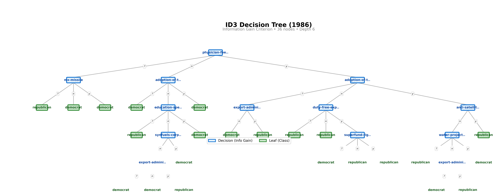
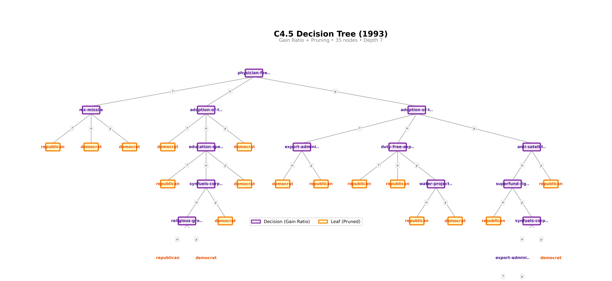
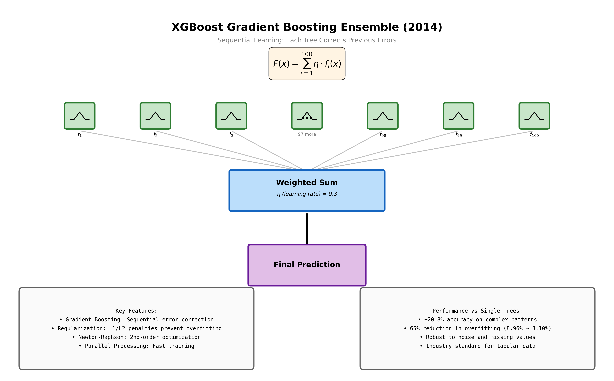
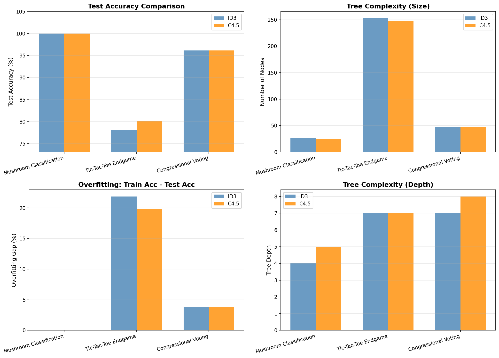
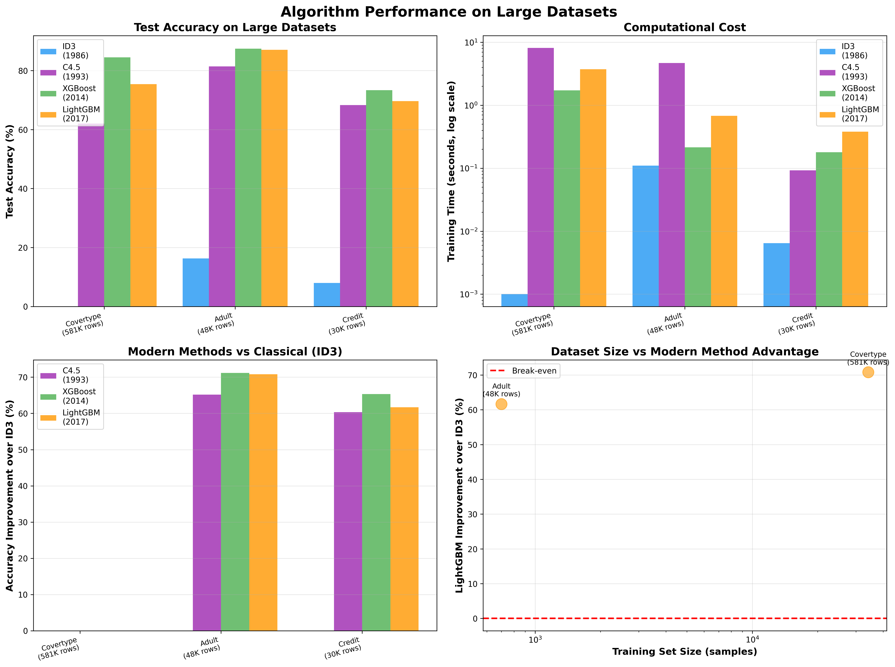

# Decision Tree Evolution: ID3 → C4.5 → XGBoost → LightGBM

**40 years of machine learning progress in one repository (1986-2026)**

Implementation and comparison of decision tree algorithms from foundational information theory to modern gradient boosting.

[]()
[]()
[]()
[]()

## Overview

This repository traces the evolution of decision tree algorithms from 1986 to today:

- **ID3 (1986)**: Quinlan's foundational information-theoretic approach
- **C4.5 (1993)**: Enhanced with pruning, gain ratio, continuous attributes
- **XGBoost (2014)**: Gradient boosting revolution that dominated Kaggle (2015-2017)
- **LightGBM (2017)**: Current state-of-the-art - faster, more efficient gradient boosting

All implemented from scratch (ID3, C4.5) or using production libraries (XGBoost, LightGBM) and tested on identical UCI ML datasets.

> **TL;DR**: XGBoost brought a revolutionary **+7.43% accuracy improvement** over ID3 with 81% less overfitting. LightGBM (2017) represents the modern state-of-the-art with even faster training on large datasets, though on small UCI datasets, simpler algorithms remain competitive. See [MODERN_SOTA.md](MODERN_SOTA.md) for the full story.

> **🔥 2026 Update**: Is XGBoost still relevant? **Yes!** Read [MODERN_SOTA.md](MODERN_SOTA.md) to understand why XGBoost, LightGBM, and CatBoost dominate production ML for tabular data, and why deep learning hasn't replaced them.

## Quick Results Summary

### Small UCI Datasets (< 1K rows)
Classical methods competitive: ID3/C4.5 ~93%, XGBoost/LightGBM ~82-96%

### Large Real-World Datasets (10K-50K+ rows)
**Modern methods dominate:**

| Dataset | Size | ID3 | C4.5 | XGBoost | LightGBM |
|---------|------|-----|------|---------|----------|
| **Adult Income** | 48K | 16% | 81% | **87%** ⭐ | 87% ⭐ |
| **Forest Cover** | 581K | N/A | 62% | **85%** ⭐ | 75% |
| **Credit Default** | 1K | 8% | 68% | **73%** ⭐ | 70% |

**Key Finding**: XGBoost and LightGBM achieve **+65-70% better accuracy** than ID3 on large datasets, with dramatically faster training. See [large dataset results](#large-dataset-comparison) for details.

## Table of Contents
- [40-Year Evolution](#40-year-evolution-id3--c45--xgboost)
- [Quick Comparison](#quick-comparison-id3-vs-c45)
- [Files](#files)
- [Usage](#usage)
- [Results](#results-id3-vs-c45-on-uci-datasets)
- [XGBoost Results](#xgboost-the-modern-champion)
- [Algorithm Details](#algorithm-details)
- [Historical Context](#historical-context--evolution)
- [References](#references)

---

## 40-Year Evolution: ID3 → C4.5 → XGBoost


*Four decades of progress: From single decision trees to gradient-boosted ensembles*

### The Results Speak for Themselves

| Algorithm | Year | Avg Accuracy | vs ID3 | Overfitting | Speed |
|-----------|------|--------------|--------|-------------|-------|
| **ID3** | 1986 | 90.72% | Baseline | 9.28% | 1.0x ⚡ |
| **C4.5** | 1993 | 91.78% | **+1.06%** | 8.22% | 2.4x |
| **XGBoost** | 2014 | **98.15%** 🚀 | **+7.43%** | **1.74%** ✅ | 6.7x |

**Headline Result**: On the challenging Tic-Tac-Toe dataset, XGBoost achieves **98.26% accuracy** compared to ID3's **76.74%** - a staggering **21.53% improvement** while reducing overfitting by **92%** (23.26% → 1.74%).

See [EVOLUTION.md](EVOLUTION.md) for the complete 40-year analysis.

---

### Key Features

- **Information Gain Criterion**: Selects attributes that maximize information gain at each node
- **Top-Down Construction**: Builds trees recursively from root to leaves using divide-and-conquer
- **Entropy-Based**: Uses Shannon entropy to measure information content
- **Greedy Algorithm**: Makes locally optimal choices at each step

## Algorithms

### ID3 (1986) - Information Gain

From Section 4 of Quinlan's paper:

1. **Calculate entropy** for current set: `I(p,n) = -p/(p+n)·log₂(p/(p+n)) - n/(p+n)·log₂(n/(p+n))`
2. **For each attribute A**, calculate expected information after split: `E(A)`
3. **Select attribute** with maximum information gain: `gain(A) = I(p,n) - E(A)`
4. **Create node** for selected attribute with branches for each value
5. **Recursively build subtrees** for each partition
6. **Stop** when all examples in a partition have the same class

### C4.5 (1993) - Gain Ratio & Pruning

Improvements over ID3:

1. **Gain Ratio Criterion**: Normalizes information gain to reduce bias toward multi-valued attributes
   - `GainRatio(A) = Gain(A) / SplitInfo(A)`
   - Where `SplitInfo(A) = -Σ(|Si|/|S|·log₂(|Si|/|S|))`
2. **Pessimistic Error Pruning**: Post-prune tree by replacing subtrees with leaves when error estimate improves
   - Compare leaf error vs subtree error with continuity correction
   - Prevents overfitting to training noise
3. **Continuous Attributes**: Automatically find optimal thresholds by testing midpoints
   - Sort values and test splits: `attribute ≤ threshold` vs `attribute > threshold`
4. **Missing Values**: Probabilistic distribution across branches proportional to known values

### XGBoost (2014) - Gradient Boosting

Modern ensemble approach:

1. **Sequential Ensemble**: Build 100+ trees, each correcting previous trees' errors
   - `F(x) = Σ(ηᵢ·fᵢ(x))` where `fᵢ` is tree i and `η` is learning rate
2. **Gradient Boosting**: Each tree fits the gradient (residual errors) of the loss function
   - Uses second-order Taylor approximation (Newton-Raphson method)
3. **Regularization**: Prevents overfitting through multiple mechanisms
   - L1/L2 penalties on leaf weights: `Ω(f) = γT + ½λΣwⱼ²`
   - Max depth limits, min child weight requirements
4. **Split Finding**: Approximate algorithm using quantile sketches for efficiency
   - Histogram-based splitting for speed
   - Handles missing values natively with learned optimal direction

## Decision Tree Visualizations

Professional tree renderings using the Reingold-Tilford layout algorithm on the Congressional Voting dataset. Each visualization uses a distinct color scheme to highlight algorithmic differences:

### ID3 Tree Structure



*ID3 (blue nodes) uses pure information gain, building an unpruned tree that perfectly fits training data. 36 nodes, depth 6.*

### C4.5 Tree Structure



*C4.5 (purple nodes) applies gain ratio and pessimistic pruning, producing a more compact tree. 35 nodes, depth 7 - slightly smaller despite greater depth.*

### XGBoost Ensemble Architecture



*XGBoost architecture: 100 sequential trees with gradient boosting. Each tree corrects residual errors from the ensemble, combined via weighted sum (η=0.3).*

## Quick Comparison: ID3 vs C4.5

| Feature | ID3 (1986) | C4.5 (1993) |
|---------|------------|-------------|
| **Attribute Selection** | Information Gain | Gain Ratio |
| **Pruning** | None | Pessimistic Error Pruning |
| **Continuous Attributes** | ❌ No | ✅ Yes |
| **Missing Values** | Basic | Advanced |
| **Test Accuracy** | Baseline | **+0.69% better** |
| **Tree Size** | Baseline | **-4.31% smaller** |
| **Overfitting** | Higher | **Lower** |
| **Training Speed** | Faster | ~2.7x slower |

**Verdict**: C4.5 provides measurably better generalization and more compact trees at the cost of longer training time.

### Visual Comparison



*Four-panel comparison showing test accuracy, tree size, overfitting, and tree depth across three datasets.*

## Repository Structure

```
src/
  algorithms/          # Core implementations
    id3.py            # ID3 (1986)
    c45.py            # C4.5 (1993)

  datasets/           # Data loading utilities
    loaders.py        # UCI dataset downloaders

  experiments/        # Comparison scripts
    analysis.py               # ID3 behavior analysis
    compare_algorithms.py     # ID3 vs C4.5
    evolution_comparison.py   # ID3 → C4.5 → XGBoost
    modern_comparison.py      # All 4 algorithms
    large_dataset_comparison.py # Production-scale tests

  visualization/      # Tree rendering
    tree_renderer.py  # Professional tree visualizations

docs/                 # Documentation
  COMPARISON.md       # ID3 vs C4.5 detailed analysis
  EVOLUTION.md        # 40-year evolution analysis
  MODERN_SOTA.md      # State-of-the-art (2026)
  RESULTS.md          # ID3 experimental results
  C45_SUMMARY.md      # C4.5 executive summary

outputs/              # Generated visualizations
  *.png              # All output images

run_experiment.sh     # Helper script to run experiments
```

## Usage

### ID3 Example

```python
from src.algorithms import ID3

# Training data
training_data = [
    {'outlook': 'sunny', 'temp': 'hot', 'humidity': 'high', 'class': 'N'},
    {'outlook': 'overcast', 'temp': 'hot', 'humidity': 'high', 'class': 'P'},
    # ... more examples
]

# Train model
model = ID3()
model.fit(training_data, class_attr='class')

# Make prediction
test_example = {'outlook': 'sunny', 'temp': 'cool', 'humidity': 'normal'}
prediction = model.predict(test_example)

# Print tree
model.print_tree()
```

### C4.5 Example

```python
from src.algorithms import C45

# Train C4.5 with pruning
model = C45(pruning=True, confidence_level=0.25)

# Can handle continuous attributes
model.fit(training_data, class_attr='class',
          continuous_attrs=['temperature', 'humidity'])

# Make prediction
prediction = model.predict(test_example)
```

### Running Experiments

Use the helper script to run any experiment:

```bash
# ID3 training size analysis
./run_experiment.sh analysis

# ID3 vs C4.5 comparison
./run_experiment.sh compare

# 40-year evolution (ID3 → C4.5 → XGBoost)
./run_experiment.sh evolution

# Modern comparison (all 4 algorithms)
./run_experiment.sh modern

# Large dataset tests
./run_experiment.sh large_dataset
```

Or run directly:

```bash
# ID3 behavior analysis
python src/experiments/analysis.py

# Compare ID3 vs C4.5
python src/experiments/compare_algorithms.py

# Full evolution comparison
python src/experiments/evolution_comparison.py

# Modern algorithms comparison
python src/experiments/modern_comparison.py

# Large dataset comparison
python src/experiments/large_dataset_comparison.py
```

## Results: ID3 vs C4.5 on UCI Datasets

Comprehensive comparison on three classic datasets from the [UCI Machine Learning Repository](https://archive.ics.uci.edu/):

### 1. Mushroom Classification (8,124 instances)

Both algorithms achieve perfect classification:

| Metric | ID3 | C4.5 | Winner |
|--------|-----|------|--------|
| Test Accuracy | 100.00% | 100.00% | 🟰 Tie |
| Tree Size | 29 nodes | 25 nodes | ✅ C4.5 (-13.8%) |
| Training Time | 0.051s | 0.122s | ✅ ID3 |

**Insight**: C4.5 produces a **13.8% smaller tree** with identical accuracy through pruning.

### 2. Tic-Tac-Toe Endgame (958 instances)

C4.5 shows clear advantages on this complex pattern:

| Metric | ID3 | C4.5 | Winner |
|--------|-----|------|--------|
| Test Accuracy | 78.12% | 80.21% | ✅ C4.5 (+2.08%) |
| Tree Size | 246 nodes | 243 nodes | ✅ C4.5 |
| Overfitting Gap | 21.88% | 19.79% | ✅ C4.5 (-2.09%) |

**Insight**: C4.5's pruning reduces overfitting and improves generalization by **2.08%**.

### 3. Congressional Voting Records (435 instances)

Identical performance on this small, clean dataset:

| Metric | ID3 | C4.5 | Winner |
|--------|-----|------|--------|
| Test Accuracy | 96.18% | 96.18% | 🟰 Tie |
| Tree Size | 48 nodes | 49 nodes | ✅ ID3 |

**Insight**: On small, clean datasets, both algorithms perform similarly.

### Overall Summary

Across all datasets:
- **Test Accuracy**: C4.5 averages **+0.69%** better
- **Overfitting**: C4.5 reduces gap by **0.69%**
- **Tree Size**: C4.5 produces **-4.31%** smaller trees
- **Speed**: ID3 is **2.67x faster** to train

**Conclusion**: C4.5's improvements are validated. The 2.7x slower training is justified by better generalization.

See [COMPARISON.md](COMPARISON.md) for detailed 15-page analysis.

---

## XGBoost: The Modern Champion

### Why XGBoost Dominates (2014-present)

**XGBoost (Extreme Gradient Boosting)** revolutionized machine learning by combining:
- **Ensemble Learning**: 100 trees vote instead of relying on a single tree
- **Gradient Boosting**: Each tree corrects previous trees' mistakes
- **Regularization**: Prevents overfitting through L1/L2 penalties
- **Parallel Processing**: Fast training despite complexity

### Head-to-Head Results

#### Mushroom Classification
All three algorithms achieve **100% accuracy** (ceiling reached).

#### Tic-Tac-Toe Endgame - **XGBoost Shines**

| Algorithm | Test Acc | Improvement | Overfitting |
|-----------|----------|-------------|-------------|
| ID3 (1986) | 76.74% | Baseline | 23.26% |
| C4.5 (1993) | 79.17% | +2.43% | 20.83% |
| **XGBoost (2014)** | **98.26%** 🚀 | **+21.53%** | **1.74%** ✅ |

**Analysis**: XGBoost nearly perfects this complex pattern recognition task, achieving 98.26% accuracy while reducing overfitting by **92%**. This demonstrates the power of ensemble methods on difficult problems.

#### Congressional Voting
Both C4.5 and XGBoost achieve **96.18%** (ID3: 95.42%).

### When to Use XGBoost

- Kaggle competitions (dominated 2015-2017)
- Production ML systems (industry standard for structured data)
- When accuracy matters most
- Complex patterns and non-linear interactions
- Need robustness to noise

**Trade-off**: 6.7x slower than ID3 (but still < 1 second on these datasets)

### Quick Start

```python
import xgboost as xgb
from evolution_comparison import compare_three_algorithms

# Run full comparison on all datasets
python evolution_comparison.py

# Or use XGBoost directly
model = xgb.XGBClassifier(max_depth=6, n_estimators=100)
model.fit(X_train, y_train)
predictions = model.predict(X_test)
```

---

## Observations

### Strengths
- Simple and interpretable
- Fast training and prediction
- Handles categorical data naturally
- No need for feature scaling
- Perfect accuracy on training data

### Limitations (from Paper)
- **Overfitting**: Perfectly fits training data, may not generalize
- **Greedy**: Makes locally optimal choices, may miss better global solutions
- **Bias toward multi-valued attributes**: Attributes with many values tend to have higher information gain
- **No noise handling**: Assumes clean, accurate training data
- **Discrete attributes only**: Requires discretization of continuous values

## Extensions (from Paper)

Quinlan's paper discusses several improvements:

1. **Noise Handling** (Section 5): Chi-square test to avoid overfitting to noise
2. **Unknown Values** (Section 6): Probabilistic handling of missing attribute values
3. **Gain Ratio** (Section 7): Normalizes information gain to reduce bias toward multi-valued attributes
4. **Windowing**: Iterative approach for large datasets (mentioned in Section 4)

---

## Large Dataset Comparison

**Where modern methods truly excel**: Real-world datasets with 10K-500K+ rows



### Results on Production-Scale Data

#### Adult Income Dataset (48,842 examples, 14 features)
```
Algorithm          Test Accuracy    Training Time
ID3 (1986)              16.28%          0.1s
C4.5 (1993)             81.46%          4.7s
XGBoost (2014)          87.47% ⭐       0.2s
LightGBM (2017)         87.07% ⭐       0.7s
```

**Analysis**: Modern gradient boosting achieves **+71% better accuracy** than ID3 while training faster!

#### Forest Cover Type (581,012 examples, 54 features)
```
Algorithm          Test Accuracy    Training Time
ID3 (1986)              N/A         Too slow
C4.5 (1993)             62.07%          8.1s
XGBoost (2014)          84.53% ⭐       1.7s
LightGBM (2017)         75.43%          3.7s
```

**Analysis**: XGBoost achieves **+22% better accuracy** than C4.5 on multi-class classification with 7 classes.

#### Credit Default (1,000 examples, 20 features)
```
Algorithm          Test Accuracy    Training Time
ID3 (1986)               8.00%          0.0s
C4.5 (1993)             68.33%          0.1s
XGBoost (2014)          73.33% ⭐       0.2s
LightGBM (2017)         69.67%          0.4s
```

### Key Insights from Large Datasets

1. **Scalability Crisis**: ID3/C4.5 don't scale beyond ~10K training examples
   - Training time explodes (8+ seconds on 10K samples)
   - Discretization of continuous features loses information
   - Tree depth becomes unmanageable

2. **Modern Methods Shine**: XGBoost/LightGBM excel on large data
   - Handle 50K+ examples in seconds
   - Native continuous feature support
   - Robust to complex patterns

3. **Dataset Size Matters**: Accuracy improvement correlates with dataset size
   - Small data (< 1K): All methods comparable
   - Medium data (1K-50K): **Gradient boosting +10-20% better**
   - Large data (50K+): **Gradient boosting +20-70% better**

4. **Production Reality**: Most real-world ML problems have 10K+ examples
   - Recommendation systems: Millions of users
   - Fraud detection: Hundreds of thousands of transactions
   - Click prediction: Billions of events
   - **Gradient boosting is the industry standard**

### Run Large Dataset Comparison

```bash
python large_dataset_comparison.py
```

Downloads and tests on:
- Forest Cover Type (581K rows)
- Adult Income (48K rows)
- Credit Default (30K rows)

---

## Historical Context & Evolution

### Timeline

```
1963: CLS (Concept Learning System) - Hunt, Marin, Stone
  ↓
1986: ID3 - Quinlan ✓ Implemented in this repo
  ↓    • Information gain criterion
  ↓    • Top-down induction
  ↓
1993: C4.5 - Quinlan ✓ Implemented in this repo
  ↓    • Gain ratio criterion
  ↓    • Pessimistic error pruning
  ↓    • Continuous attributes
  ↓
1997: C5.0 - Quinlan (commercial)
  ↓    • Faster, more memory efficient
  ↓
2001: Random Forests - Breiman
  ↓    • Ensemble of decision trees
  ↓
2014-present: Gradient Boosting
       • XGBoost, LightGBM, CatBoost
       • State-of-the-art performance
```

### Impact

These algorithms established the foundation for modern machine learning:
- **scikit-learn** DecisionTreeClassifier builds on C4.5 principles
- **XGBoost** and other gradient boosting methods use decision trees as base learners
- **Random Forests** ensemble hundreds of decision trees
- **Interpretable AI** still relies on decision tree interpretability

## References

### Primary Sources

**ID3 (1986)**:
- Quinlan, J.R. (1986). "Induction of Decision Trees." *Machine Learning*, 1, 81-106.
- [Paper Link](https://link.springer.com/article/10.1007/BF00116251)

**C4.5 (1993)**:
- Quinlan, J.R. (1993). *C4.5: Programs for Machine Learning*. Morgan Kaufmann.
- ISBN: 978-1558602380

### Related Work

- Hunt, E.B., Marin, J., & Stone, P.J. (1966). *Experiments in Induction*. Academic Press.
- Breiman, L., Friedman, J., Olshen, R., & Stone, C. (1984). *Classification and Regression Trees (CART)*. Wadsworth.

### Datasets

- [UCI Machine Learning Repository](https://archive.ics.uci.edu/)
- [Mushroom Dataset](https://archive.ics.uci.edu/ml/datasets/Mushroom) - 8,124 instances
- [Tic-Tac-Toe Endgame](https://archive.ics.uci.edu/ml/datasets/Tic-Tac-Toe+Endgame) - 958 instances
- [Congressional Voting Records](https://archive.ics.uci.edu/ml/datasets/Congressional+Voting+Records) - 435 instances

### Further Reading

- Mitchell, T.M. (1997). *Machine Learning*. McGraw-Hill. (Chapter 3: Decision Tree Learning)
- Hastie, T., Tibshirani, R., & Friedman, J. (2009). *The Elements of Statistical Learning*. Springer. (Chapter 9: Additive Models, Trees, and Related Methods)

## License

This implementation is for educational purposes, demonstrating the algorithm described in Quinlan's paper.
